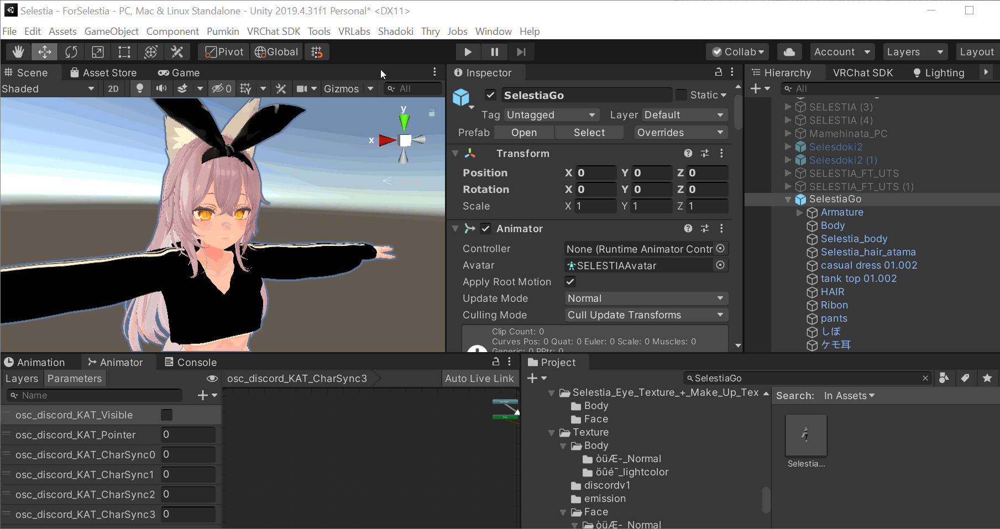
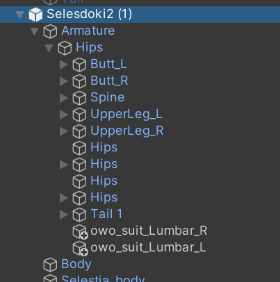
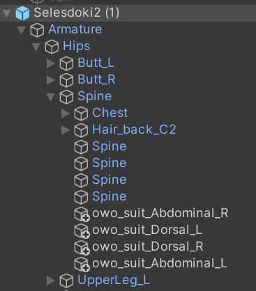
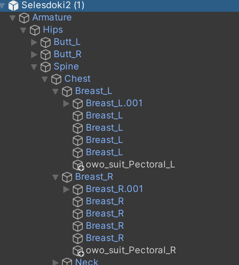
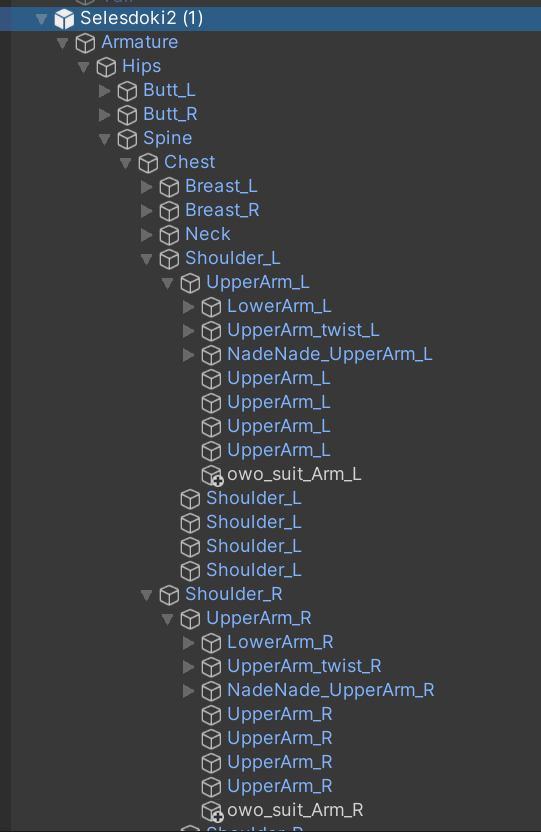
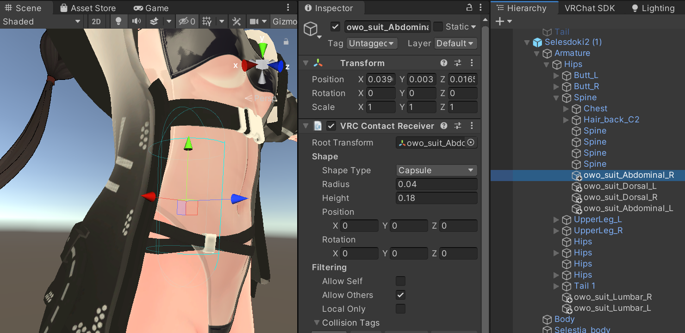

# vrc-owo-suit

A python application for VRChat players to use OWO Suits in game

## Table of Contents

- [Installation](#installation)
- [Contributing](#contributing)

## Installation

---

Head over to the [Releases](https://github.com/uzair-ashraf/vrc-owo-suit/releases) page to get the latest release.

1. Download the executable.

1. Download the Unity Package.

1. In the same directory where you put your executable, create a new file named `vrc-owo-suit.config.json`.

1. In `vrc-owo-suit.config.json` paste the following values:

   ```json
   {
      "server_port": 9001,
      "owo_ip": "YOUR OWO SUIT'S IP ADDRESS HERE"
   }
   ```

1. In your OWO Suit's application, copy the IP Address and replace the provided value in the `owo_ip` property.


1. Open your Unity Project and open the provided Unity package. ([More Instructions](#setting-up-your-avatar) on this below)

## Contributing

---

### Requirements

- Python 3.10.9
- Windows 10
- OWO Suit or Visualizer

1. Clone the repository

   ```shell
   git clone git@github.com:uzair-ashraf/vrc-owo-suit.git
   cd vrc-owo-suit
   ```

1. Install Dependencies

   ```shell
   pip install -r requirements.txt
   ```

1. Run

   ```shell
   python main.py
   ```

1. Build a standalone executable

   This repository is setup with a Github action to compile the standalone executable. If you would like to compile it on your local machine you can read the action for the command via `pyinstaller` [here](./.github/workflows/release.yml).

## Setting up your avatar

If this your first time working with OSC head over to the [VRChat docs to learn more](https://docs.vrchat.com/docs/osc-overview).

This doc assumes you have a Unity Package with an avatar already set up to be published to VRChat along with some knowledge of how to use Unity.

1. Head over to the [releases](https://github.com/uzair-ashraf/vrc-owo-suit/releases) page and download the unity package from the latest release.

1. Open your Unity Project with your avatar.

1. Import the unity package from the latest release.

1. In the toolbar click `Shadoki > OWOSuit`, add your avatar to the field, and click add.

   <p align="center">
      
   </p>

1. Place the newly generated game objects in the armature of your avatar. In a future update I expect to automatically place them in the generation, but for the initial release you will have to do it manually. Keep in mind the names of your bones may differ, but their placements should just match where they would be on your body.

   - Place both `owo_suit_Lumbar_R` and `owo_suit_Lumbar_L` into your Hip Bone.

      <p align="center">
         
      </p>

   - Place `owo_suit_Abdominal_R`, `owo_suit_Abdominal_L`, `owo_suit_Dorsal_R`, and `owo_suit_Dorsal_L` into your Spine Bone.

      <p align="center">
         
      </p>

   - Place `owo_suit_Pectoral_L` and `owo_suit_Pectoral_R` into your corresponding Breast bones. If you do not have Breast bones, then your Chest bone will suffice.

      <p align="center">
         
      </p>

   - Place `owo_suit_Arm_R` and `owo_suit_Arm_L` into your corresponding UpperArm bones.

      <p align="center">
         
      </p>

1. Every avatar is different in size therefore every avatar's collissions will be different. Go through each game object starting with `owo_suit` and adjust the `VRC Contact Receiver` script to change the size of the capsule collider. This is where the detection will occur, so you can make the area for each collision bigger or smaller if you'd like.

   In the example below you can see that this contact is for the right abdomen. I adjusted the capsule size to map out the right portion of the abdomen. 
 
   <p align="center">
      
   </p>


1. If you are having trouble getting the OSC program to communicate with VRChat, checkout this troubleshooting doc that Wizard wrote for their TTS App: https://github.com/VRCWizard/TTS-Voice-Wizard/wiki/OSC-Troubleshooting
