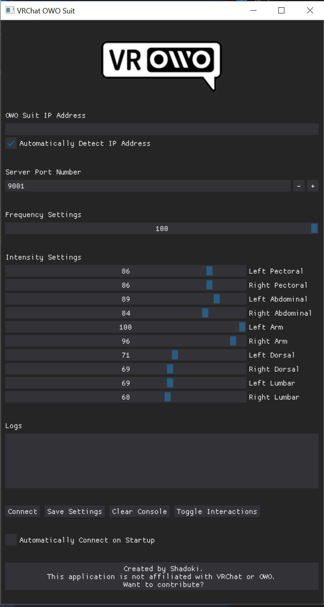
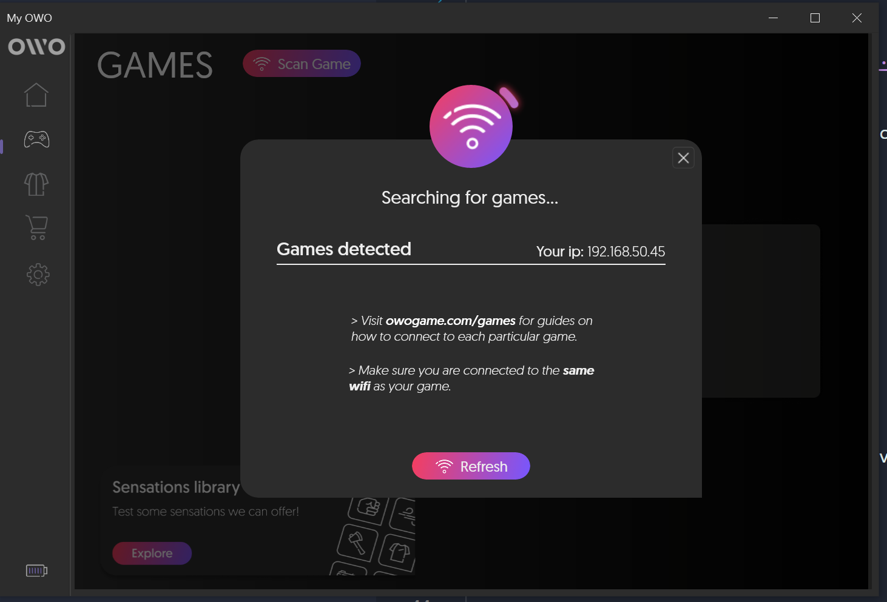
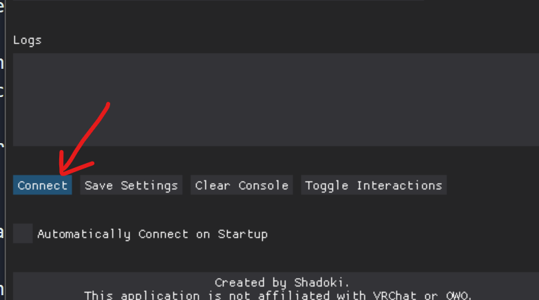
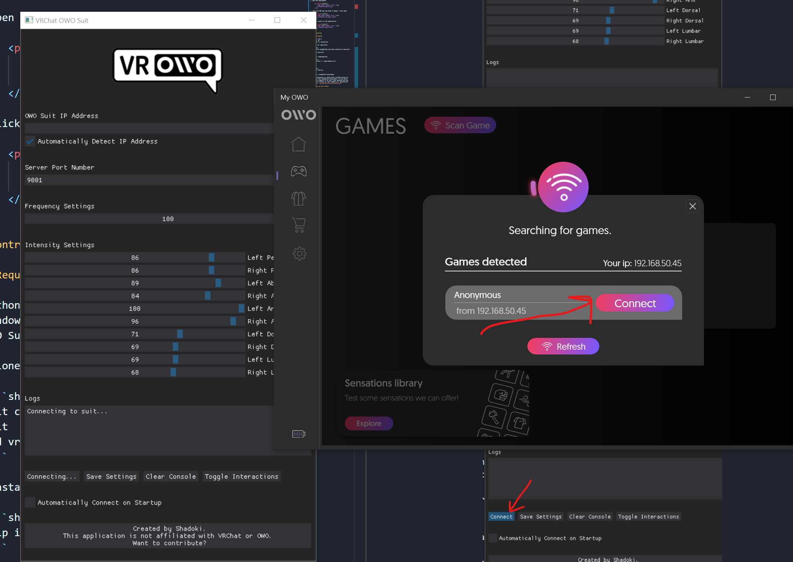
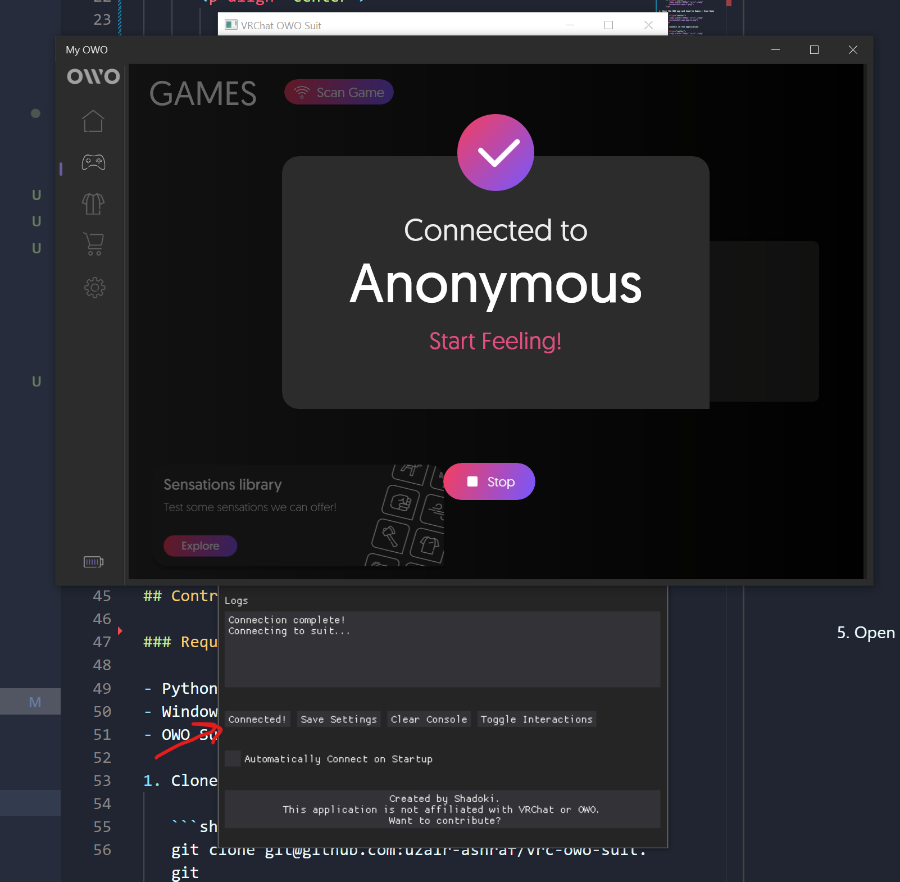
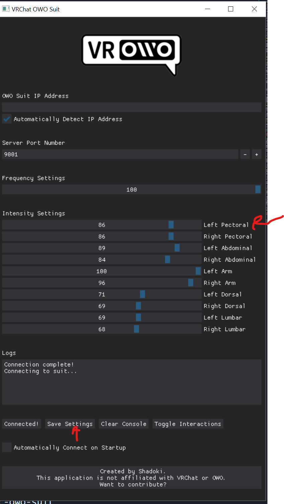

# Disclaimer

This application is not affiliated with VRChat or OWO. By using this software you agree to not sue or get upsetti spaghetti with me if it breaks something. Use at your own risk.

## Table of Contents

- [Installation](#installation)
- [Settings](#settings)
- [Contributing](#contributing)

## Installation

Head over to the [Releases](https://github.com/uzair-ashraf/vrc-owo-suit/releases) page to get the latest release.

1. Download the executable.

1. Download the Unity Package.

1. Open your Unity Project, open the provided Unity package, and setup your avatar ([More Instructions](#setting-up-your-avatar) on this below)

1. Run the executable
   
      <p align="center">
         
      </p>

1. Open the OWO app and head to Games > Scan Game 

      <p align="center">
         
      </p>

1. Click connect in the application
   
      <p align="center">
         
      </p>

1. Click connect in the OWO app
   
      <p align="center">
         
      </p>

1. If everything works, both applications should say that they are connected!
   
      <p align="center">
         
      </p>

## Settings

1. OWO Suit IP Address
   
   You should leave this empty and leave the checkbox below checked, the OWO app can detect your suit fairly easily. I'm not sure what their usecase is for an IP address, maybe multiple suits on one machine?

1. Server Port Number
   
   Leave this at `9001`, only change if you know what you're doing!
   
1. Frequency Settings
   
   I keep this at 100, I think it's for how abrupt the sensation is?
   
1. Intensity Settings
   
   When calibrating your suit with the OWO app you will set some limitations for each muscle group, to prevent from shocking yourself too much.
   
   When you enter VRChat, you'll realize that you have a higher tolerance for some muscles rather than others.

   <p align="center">
      
   </p>

   You can adjust the intensity settings in real time, and when you are done, you can click `Save Settings` to keep the app's settings for the next time you start it.

   Also, if you're having trouble telling which muscle is active when you're feeling them, the intensity settings labels will change when your muscles are being interacted with.

   In other words, if your `Left Pectoral` is touched, it will update in the UI as `[Left Pectoral]`
   

## Contributing

### Requirements

- Python 3.10.9
- Windows 10
- OWO Suit or Visualizer

1. Clone the repository

   ```shell
   git clone git@github.com:uzair-ashraf/vrc-owo-suit.git
   cd vrc-owo-suit
   ```

1. Install Dependencies

   ```shell
   pip install -r requirements.txt
   ```

1. Run

   ```shell
   python main.py
   ```

1. Build a standalone executable

   This repository is setup with a Github action to compile the standalone executable. If you would like to compile it on your local machine you can read the action for the command via `pyinstaller` [here](./.github/workflows/release.yml).

## Setting up your avatar

If this your first time working with OSC head over to the [VRChat docs to learn more](https://docs.vrchat.com/docs/osc-overview).

This doc assumes you have a Unity Package with an avatar already set up to be published to VRChat along with some knowledge of how to use Unity.

1. Head over to the [releases](https://github.com/uzair-ashraf/vrc-owo-suit/releases) page and download the unity package from the latest release.

1. Open your Unity Project with your avatar.

1. Import the unity package from the latest release.

1. In the toolbar click `Shadoki > OWOSuit`, add your avatar to the field, and click add.

   <p align="center">
      
   </p>

1. Place the newly generated game objects in the armature of your avatar. In a future update I expect to automatically place them in the generation, but for the initial release you will have to do it manually. Keep in mind the names of your bones may differ, but their placements should just match where they would be on your body.

   - Place both `owo_suit_Lumbar_R` and `owo_suit_Lumbar_L` into your Hip Bone.

      <p align="center">
         
      </p>

   - Place `owo_suit_Abdominal_R`, `owo_suit_Abdominal_L`, `owo_suit_Dorsal_R`, and `owo_suit_Dorsal_L` into your Spine Bone.

      <p align="center">
         
      </p>

   - Place `owo_suit_Pectoral_L` and `owo_suit_Pectoral_R` into your corresponding Breast bones. If you do not have Breast bones, then your Chest bone will suffice.

      <p align="center">
         
      </p>

   - Place `owo_suit_Arm_R` and `owo_suit_Arm_L` into your corresponding UpperArm bones.

      <p align="center">
         
      </p>

   - (OPTIONAL) Add a parameter called "owo_intensity" to the avatar parameters and also add it to the menu with a radial control.

1. Every avatar is different in size therefore every avatar's collissions will be different. Go through each game object starting with `owo_suit` and adjust the `VRC Contact Receiver` script to change the size of the capsule collider. This is where the detection will occur, so you can make the area for each collision bigger or smaller if you'd like.

   In the example below you can see that this contact is for the right abdomen. I adjusted the capsule size to map out the right portion of the abdomen. 
 
   <p align="center">
      
   </p>


1. If you are having trouble getting the OSC program to communicate with VRChat, checkout this troubleshooting doc that Wizard wrote for their TTS App: https://github.com/VRCWizard/TTS-Voice-Wizard/wiki/OSC-Troubleshooting
